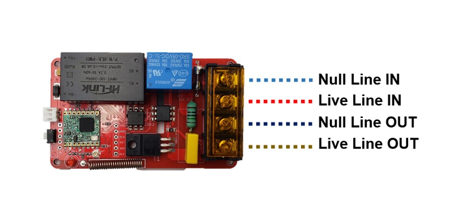

# Makerfabs Lora AC Dimmer

```c++
/*
Version:		V1.0
Author:			Vincent
Create Date:	2021/7/31
Note:
	
*/
```


[toc]

# Makerfabs

[Makerfabs home page](https://www.makerfabs.com/)

[Makerfabs Wiki](https://makerfabs.com/wiki/index.php?title=Main_Page)


# Makerfabs Lora AC Dimmer

## Intruduce

Product Link ：[]()

Wiki Link :  [LoRa_AC_Dimmer](https://www.makerfabs.com/wiki/index.php?title=LoRa_AC_Dimmer) 


AC dimmer is designed to control the alternating current voltage, it is used to control the LED light, electronic heating element and the AC motor. LoRa AC Dimmer module is based on Atmel's Atmega328P to control the dimmer through the PWM signal the MCU generated. The board also features the LoRa module on board that provides a solution for controlling remotely.

This is a special module that Makerfabs had burned the firmware to it before shipping. After receiving the package, it can be controlled to turn on or off, or turn the output by 35% through the Specific command, and it does not require additional programming.


## Feature

- ATMEL Atmega328P: High Performance, Low Power Atmel®AVR® Classic Microcontroller
- Speed Grade: 20Mhz
- Flash: 32KBytes
- RAM: 2KBytes
- EEPROM: 1Kbytes
- Onboard LoRa module
- Photocoupler, 400V peak off-state voltage
- With integrated Phase detection and Zero Crossing Detection processing
- 5V Relay for shutting off absolutely
- Fuse with 250V and 1.5A

### Front:



### Back:


## Compiler Options
**If you have any questions，such as how to install the development board, how to download the code, how to install the library. Please refer to :[Makerfabs_FAQ](https://github.com/Makerfabs/Makerfabs_FAQ)**

- Please disconnect from the electrical equipment before burning!
- Do not burn with alternating current!

- Upload codes, select "Arduino Pro or Pro Mini" and "3.3V 8MHz"

## Example List

### example\RadioLib-demo

Factory firmware. But device id should different.

With Maduino Lora Radio, or another Marduino Lora device based on 328p. Of course, two AC Dimmers can also be used, one as the sender and one as the receiver.

AC Dimmer's Phase cutting is controlled by a plaintext Lora message

### example\RadioHead-demo

Using RadioHead's Lora library, tests found that it seemed impossible to communicate with RadioLib. RadioHead may not be available under ESP32. (Not sure, maybe my configuration is wrong.)

With Maduino Lora Radio, or another Marduino Lora device based on 328p. Of course, two AC Dimmers can also be used, one as the sender and one as the receiver.


## Lora Instruction 

### Instruction Format

A typical instruction is:

```
ID000123ACT001PARAM000000#
```

Divided into three parts:

- Device ID: ID000123
- Action ID: ACT001
- Parameter: PARAM000000

The preceding zeros must not be omitted.

### Device Id

The device ID is the factory serial number of manual burning, manual modification when burning, has nothing to do with the equipment.The action continues only when a command with the same device ID is received.

Generally, the value is ID+6 digits.

```
ID000001
```

Can be customized by the user, also provided to get the 328P chip UID routines.

### Action ID

#### ACT = 0 Close

Close Dimmer and cut relay.

```
  ID000123ACT000PARAM000000#
```

All open dimmer which named ID000123.

#### ACT = 1 All Open

All open Dimmer and relay.

Example:

```
  ID000123ACT000PARAM000000#
```
All close dimmer which named ID000123.

#### ACT = 2 PWM 

Set dimmer's phase cutting.

- Phase cutting : PARAM % 1000 = 0-255

Example:

```
  ID000123ACT002PARAM005150#
```
Set dimmer's phase cutting to 150/255 which named ID000123.
#### ACT = 3 PWM DELAY ON  (delay and then close)

Set dimmer's phase cutting in seconds and then close the dimmer.

- Phase cutting : PARAM % 1000 = 0-255
- Delay time (second) :   PARAM / 1000 = 0-999

Example:

```
  ID000123ACT003PARAM005060#
```
Set dimmer's phase cutting to 60/225 which named ID000123. And all open after 5 seconds.
#### ACT = 4 PWM DELAY OFF  (delay and then all on)

Set dimmer's phase cutting in seconds and then all open the dimmer.

- Phase cutting : PARAM % 1000 = 0-255
- Delay time (second) :   PARAM / 1000 = 0-999

Example:

```
  ID000123ACT004PARAM005060#
```
Set dimmer's phase cutting to 60/225 which named ID000123. And all close after 5 seconds.

